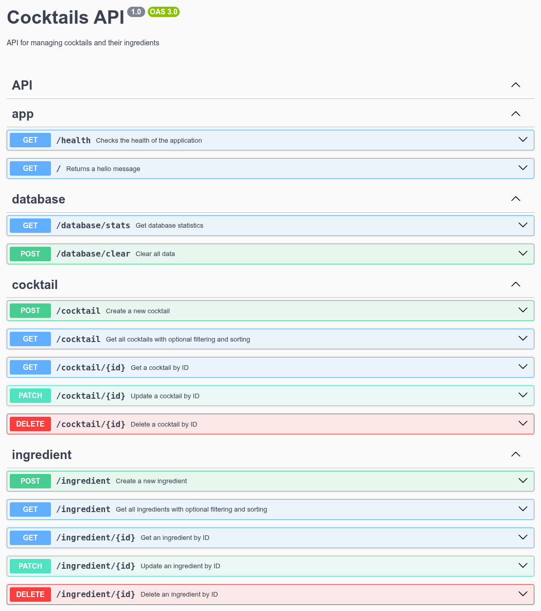
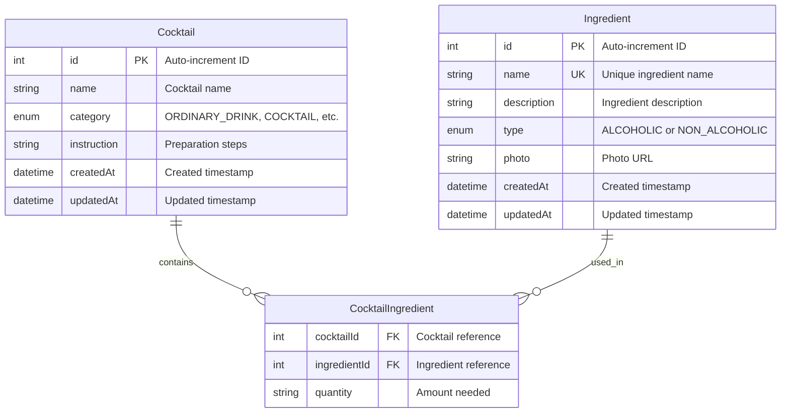

# 🍹 Koktajlownik API

<p align="center">
    <strong>Your ultimate cocktail recipe management API</strong>
</p>

## Tech Stack

<div align="center">

[](https://nestjs.com/) [](https://www.prisma.io/) [](https://www.postgresql.org/) [](https://nodejs.org/)

[](https://swagger.io/) []() [](LICENSE)

</div>

## About the Project

**Koktajlownik** is a RESTful API for managing cocktail recipes and ingredients. Built with NestJS and Prisma, it provides a robust backend for cocktail enthusiasts, bartenders, and recipe management applications.

### Key Features

- **Cocktail Management** - Full CRUD operations for cocktail recipes
- **Ingredient Database** - Comprehensive ingredient management with types (alcoholic/non-alcoholic)
- **Advanced Filtering** - Search and filter cocktails by category, name, and ingredients
- **Database Statistics** - Real-time statistics about your cocktail collection
- **Comprehensive Testing** - Unit and E2E tests with isolated test database

## API Documentation

Once the server is running, access the interactive Swagger documentation at:

```
http://localhost:5000/api
```



The API provides endpoints for:

- **Cocktails** - `/cocktails` - CRUD operations, filtering, sorting
- **Ingredients** - `/ingredients` - CRUD operations, filtering, sorting
- **Database** - `/database` - Statistics and health checks

## Database Schema



## API Endpoints

### Cocktails

| Method   | Endpoint         | Description                      |
| -------- | ---------------- | -------------------------------- |
| `GET`    | `/cocktails`     | Get all cocktails with filtering |
| `GET`    | `/cocktails/:id` | Get cocktail by ID               |
| `POST`   | `/cocktails`     | Create new cocktail              |
| `PATCH`  | `/cocktails/:id` | Update cocktail                  |
| `DELETE` | `/cocktails/:id` | Delete cocktail                  |

**Query Parameters:**

- `category` - Filter by category
- `name` - Filter by name (partial match)
- `sortBy` - Sort by field (name, category, createdAt)
- `sortOrder` - Sort direction (asc, desc)

### Ingredients

| Method   | Endpoint           | Description                        |
| -------- | ------------------ | ---------------------------------- |
| `GET`    | `/ingredients`     | Get all ingredients with filtering |
| `GET`    | `/ingredients/:id` | Get ingredient by ID               |
| `POST`   | `/ingredients`     | Create new ingredient              |
| `PATCH`  | `/ingredients/:id` | Update ingredient                  |
| `DELETE` | `/ingredients/:id` | Delete ingredient                  |

**Query Parameters:**

- `type` - Filter by type
- `name` - Filter by name (partial match)
- `sortBy` - Sort by field (name, type, createdAt)
- `sortOrder` - Sort direction (asc, desc)

## Environment Variables

| Variable            | Description                           | Required                  |
| ------------------- | ------------------------------------- | ------------------------- |
| `DATABASE_URL`      | Production database connection string | Yes                       |
| `DATABASE_URL_TEST` | Test database connection string       | Yes (for testing)         |
| `PORT`              | Server port                           | No (default: 5000)        |
| `NODE_ENV`          | Environment mode                      | No (default: development) |

---

## Available Scripts

### Development

```bash
npm run start:dev          # Start development server with watch mode
npm run start:debug        # Start with debugging enabled
npm run build              # Build for production
npm run start:prod         # Start production server
```

### Database

```bash
npx prisma generate        # Generate Prisma Client
npx prisma migrate dev     # Create and apply migrations
npx prisma db seed         # Seed the database
npx prisma studio          # Open Prisma Studio GUI
```

### Testing

```bash
npm run test               # Run unit tests
npm run test:watch         # Run tests in watch mode
npm run test:cov           # Run tests with coverage
npm run test:e2e           # Run E2E tests
npm run test:e2e:watch     # Run E2E tests in watch mode
```

### Code

```bash
npm run format             # Format code with Prettier
npm run format:check       # Check code formatting
npm run typecheck          # TypeScript type checking
npm run lint               # Run ESLint
```
